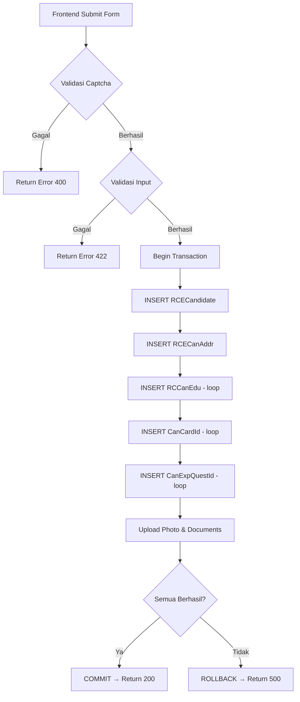

# API Documentation: Submit Candidate (Apply Job)

> **Endpoint**: `POST /api/candidates/apply`  
> **Content-Type**: `multipart/form-data`  
> **Description**: Menyimpan data kandidat dari form lamaran kerja (Apply Job) ke beberapa tabel sekaligus.

---

## Overview

Form **Apply Job** di frontend mengirimkan data kandidat yang perlu di-_insert_ ke **5 tabel** berikut:

| No | Table | Deskripsi |
|----|-------|-----------|
| 1 | `RCECandidate` | Data personal kandidat |
| 2 | `RCECanAddr` | Alamat kandidat |
| 3 | `RCCanEdu` | Riwayat pendidikan (multiple rows) |
| 4 | `CanCardId` | Identitas/kartu (multiple rows) |
| 5 | `CanExpQuestId` | Jawaban pertanyaan (multiple rows) |

> [!IMPORTANT]
> **Tidak semua field di tabel tersebut dikirimkan dari form.** Field yang tidak dikirim frontend bisa di-set `NULL`, default value, atau di-generate oleh backend (misal: `CanCode`, `CanId`, `UpdDate`, `UpdUser`, `UpdFlag`, dll).

---

## Request Payload (multipart/form-data)

### Top-level Fields

| Field Name | Type | Required | Deskripsi | Contoh |
|------------|------|----------|-----------|--------|
| `job_id` | `integer` | ✅ | ID posisi yang dilamar (`VacantPosId`) | `12` |
| `full_name` | `string` | ✅ | Nama lengkap kandidat | `"John Doe"` |
| `email` | `string` | ✅ | Email kandidat | `"john@example.com"` |
| `gender` | `string` | ✅ | Jenis kelamin: `M` / `F` | `"M"` |
| `birth_city_id` | `integer` | ✅ | **CityId** — ID kota tempat lahir (dari API `/cities`) | `15` |
| `date_of_birth` | `string (date)` | ✅ | Tanggal lahir (format `YYYY-MM-DD`) | `"1995-01-15"` |
| `marital_status_id` | `integer` | ✅ | **MaritalStId** — ID status pernikahan (dari API `/maritalstatuses`) | `1` |
| `blood_type` | `string` | ❌ | Golongan darah: `A`, `B`, `AB`, `O`, `A+`, `A-`, `B+`, `B-`, `AB+`, `AB-`, `O+`, `O-` | `"O"` |
| `race_id` | `integer` | ❌ | **RaceId** — ID suku/etnis (dari API `/races`) | `12` |
| `mobile_phone` | `string` | ✅ | Nomor HP/WhatsApp | `"081234567890"` |
| `id_card_address` | `string` | ✅ | Alamat sesuai KTP | `"Jl. Sudirman No 1"` |
| `province_id` | `integer` | ✅ | **StateId** — ID provinsi (dari API `/states`) | `31` |
| `city_id` | `integer` | ✅ | **CityId** — ID kota/kabupaten (dari API `/cities`) | `3171` |
| `zip_code` | `string` | ✅ | Kode pos | `"12190"` |
| `photo` | `File` | ❌ | Pas foto (JPEG/PNG, max 2MB) | _(binary)_ |
| `captcha_token` | `string` | ✅ | Token Cloudflare Turnstile | `"0.xxx..."` |
| `is_declared_true` | `boolean` | ✅ | Pernyataan kebenaran data | `true` |

> [!IMPORTANT]
> **Semua field referensi dari select/combobox sudah mengirimkan ID (integer) langsung.** Backend **tidak perlu** melakukan resolve nama → ID untuk field berikut: `birth_city_id`, `marital_status_id`, `race_id`, `province_id`, `city_id`, `card_type_id`, `edu_level_id`, `edu_institution_id`.

### Field Referensi yang Belum Diimplementasi di Form

Field-field berikut belum tersedia di form frontend, namun jika di masa depan ditambahkan, harus menggunakan ID:

| Field Name | Type | Deskripsi | API Source |
|------------|------|-----------|------------|
| `religion_id` | `integer` | ID agama | `/religions` |
| `edu_major_id` | `integer` | ID jurusan pendidikan | `/edumajors` |
| `edu_city_id` | `integer` | ID kota pendidikan | `/cities` |
| `citizen_id` | `integer` | ID kewarganegaraan | `/citizens` |
| `bank_id` | `integer` | ID bank | `/banks` |
| `faskes_id` | `integer` | ID fasilitas kesehatan | `/faskes` |
| `source_id` | `integer` | ID sumber rekrutmen | `/sources` |

### Nested JSON Fields (dikirim sebagai JSON string)

#### `identities` (JSON string of array)

```json
[
  {
    "card_type_id": 1,
    "number": "3201234567890001"
  },
  {
    "card_type_id": 2,
    "number": "1234567890"
  }
]
```

| Field | Type | Required | Deskripsi |
|-------|------|----------|-----------|
| `card_type_id` | `integer` | ✅ | **CardTypeId** — ID jenis kartu identitas (dari API `/cardtypes`) |
| `number` | `string` | ✅ | Nomor identitas |

#### `educations` (JSON string of array)

```json
[
  {
    "edu_level_id": 5,
    "edu_institution_id": 12,
    "major": "Teknik Informatika",
    "gpa": 3.50,
    "is_last_education": true
  }
]
```

| Field | Type | Required | Deskripsi |
|-------|------|----------|-----------|
| `edu_level_id` | `integer` | ✅ | **EduLvlId** — ID tingkat pendidikan (dari API `/edulevels`) |
| `edu_institution_id` | `integer\|string` | ✅ | **EduInsId** — ID institusi (dari API `/eduinstitutions`). Bisa juga string jika input manual |
| `major` | `string` | ❌ | Nama jurusan |
| `gpa` | `float\|null` | ❌ | IPK / Nilai rata-rata |
| `is_last_education` | `boolean` | ✅ | Apakah ini pendidikan terakhir |

#### `experiences` (JSON string of array)

```json
[
  {
    "company_name": "PT. ABC",
    "position": "Staff IT",
    "job_period_year": "2020 - 2022",
    "salary": 5000000
  }
]
```

| Field | Type | Required | Deskripsi |
|-------|------|----------|-----------|
| `company_name` | `string` | ✅ | Nama perusahaan |
| `position` | `string` | ✅ | Posisi/jabatan |
| `job_period_year` | `string` | ❌ | Tahun periode kerja |
| `salary` | `float\|null` | ❌ | Gaji terakhir (dalam Rupiah) |

> [!NOTE]
> Data `experiences` tidak termasuk dalam 5 tabel yang diberikan. Backend developer perlu menentukan ke tabel mana data ini disimpan, atau menambahkan tabel baru.

#### `answers` (JSON string of array)

```json
[
  {
    "question_id": 5,
    "answer": "Ya"
  },
  {
    "question_id": 6,
    "answer": "Tidak"
  },
  {
    "question_id": 7,
    "answer": "Saya bersedia ditempatkan di seluruh Indonesia"
  },
  {
    "question_id": 8,
    "answer": "7500000"
  }
]
```

| Field | Type | Required | Deskripsi |
|-------|------|----------|-----------|
| `question_id` | `integer` | ✅ | **QuestionId** — ID pertanyaan (dari API `/questions/grouped?topic_id=2,3`) |
| `answer` | `string` | ✅ | Jawaban: `"Ya"`/`"Tidak"` (FgAnsMode=A), teks bebas (FgAnsMode=N/Y), angka string (FgAnsMode=O) |

### File Fields (multipart)

| Field Name | Type | Required | Deskripsi |
|------------|------|----------|-----------|
| `documents[]` | `File[]` | ✅ (min 1) | File dokumen (PDF/Word, max 10MB per file) |
| `document_descriptions[]` | `string[]` | ✅ | Deskripsi per dokumen, urutan sesuai `documents[]` |

---

## Mapping: Form Fields → Database Tables

### 1. `RCECandidate`

| Column | Source (Form) | Keterangan |
|--------|--------------|------------|
| `CanId` | _auto-generated_ | Primary Key, auto increment / UUID |
| `CanCode` | _auto-generated_ | Kode kandidat, di-generate backend |
| `CanName` | `full_name` | ✅ Required |
| `CanStatus` | _default_ | Status awal kandidat (misal: `"NEW"`) |
| `CanDateBirth` | `date_of_birth` | ✅ Required, format `YYYY-MM-DD` |
| `CanSex` | `gender` | ✅ Required, `M` / `F` |
| `CanIsFore` | — | Tidak dikirim, default `false` / `0` |
| `CanMaritalStId` | `marital_status_id` | ✅ Required. **Sudah berupa `MaritalStId` (integer)** |
| `CanCityBirthId` | `birth_city_id` | ✅ Required. **Sudah berupa `CityId` (integer)** |
| `CanCityBirthName` | — | Backend bisa resolve `CityId` → `CityName` dari tabel referensi |
| `CanBloodType` | `blood_type` | Opsional |
| `CanRaceId` | `race_id` | Opsional. **Sudah berupa `RaceId` (integer)** |
| `CanReligionId` | `religion_id` | Belum dikirim dari form |
| `CanHeight` | — | Tidak dikirim dari form |
| `CanWeight` | — | Tidak dikirim dari form |
| `CanHandphone` | `mobile_phone` | ✅ Required |
| `CanEmail` | `email` | ✅ Required |
| `CanCitizenId` | `citizen_id` | Belum dikirim dari form |
| `CanSourceId` | `source_id` | Belum dikirim, bisa default "Career Page" |
| `CanSourceNote` | — | Tidak dikirim |
| `CanFrontTitle` | — | Tidak dikirim dari form |
| `CanEndTitle` | — | Tidak dikirim dari form |
| `CanEntryDate` | _auto-generated_ | Tanggal submit, `NOW()` |
| `CanApplyDate` | _auto-generated_ | Tanggal apply, `NOW()` |
| `CanCurrId` | — | Tidak dikirim |
| `CanExpSal` | _(dari experiences)_ | Bisa diisi dari salary pengalaman terakhir |
| `CanExpType` | — | Tidak dikirim |
| `CanAvailability` | — | Tidak dikirim |
| `CanAdvId` | `job_id` | ✅ ID lowongan yang dilamar (`VacantPosId`) |
| `CanOrgId` | — | Bisa diambil dari vacancy |
| `UpdDate` | _auto-generated_ | `NOW()` |
| `UpdUser` | _auto-generated_ | System / `"CAREER_PORTAL"` |
| `UpdFlag` | _default_ | `"I"` (Insert) |
| `CanSource` | — | Bisa default: `"Website"` |
| `CanNPWP` | — | Tidak dikirim dari form |
| `CanMarriedDate` | — | Tidak dikirim dari form |
| `FgChanges` | — | Tidak dikirim |
| `FgFreshGrad` | — | Tidak dikirim |
| `CanNickName` | — | Tidak dikirim dari form |
| `RefTypeId` | — | Tidak dikirim |
| `RefTypeName` | — | Tidak dikirim |
| `CanInstId` | — | Tidak dikirim |
| `CanInstName` | — | Tidak dikirim |
| `CanBPJSTKNo` | — | Tidak dikirim dari form |
| `CanBPJSKesNo` | — | Tidak dikirim dari form |
| `CanFaskesId` | `faskes_id` | Belum dikirim dari form |
| `CanBankAcc` | — | Tidak dikirim dari form |
| `CanBankName` | — | Tidak dikirim dari form |
| `CanBankId` | `bank_id` | Belum dikirim dari form |
| `FgCanCategory` | — | Tidak dikirim |
| `CanLocRecruitId` | — | Tidak dikirim |
| `CanBankAttach` | — | Tidak dikirim |
| `PPhPTKP` | — | Tidak dikirim |
| `CanBankAttachFile` | — | Tidak dikirim |

---

### 2. `RCECanAddr`

| Column | Source (Form) | Keterangan |
|--------|--------------|------------|
| `CanId` | _FK dari RCECandidate_ | Link ke kandidat |
| `CanResAddress` | `id_card_address` | ✅ Required |
| `CanResCityId` | `city_id` | **Sudah berupa `CityId` (integer)** |
| `CanResCityName` | — | Backend resolve `CityId` → `CityName` |
| `CanResStateName` | — | Backend resolve `StateId` → `StateName` dari `province_id` |
| `CanResZipCode` | `zip_code` | ✅ Required |
| `CanResStatusId` | — | Tidak dikirim |
| `CanResStatusName` | — | Tidak dikirim |
| `CanResStart` | — | Tidak dikirim |
| `CanResPhone` | `mobile_phone` | Bisa diisi dari nomor HP |
| `CanOriAddress` | `id_card_address` | Bisa duplikasi dari alamat KTP |
| `CanOriCityId` | `city_id` | Bisa duplikasi dari `city_id` |
| `CanOriCityName` | — | Backend resolve `CityId` → `CityName` |
| `CanOriStateName` | — | Backend resolve `StateId` → `StateName` |
| `CanOriZipCode` | `zip_code` | Bisa duplikasi |
| `CanOriStatusId` | — | Tidak dikirim |
| `CanOriStatusName` | — | Tidak dikirim |
| `CanOriStart` | — | Tidak dikirim |
| `CanOriPhone` | — | Tidak dikirim |
| `UpdDate` | _auto-generated_ | `NOW()` |
| `UpdUser` | _auto-generated_ | `"CAREER_PORTAL"` |
| `UpdFlag` | _default_ | `"I"` |
| `CanResRT` | — | Tidak dikirim |
| `CanOriRT` | — | Tidak dikirim |
| `CanResRW` | — | Tidak dikirim |
| `CanOriRW` | — | Tidak dikirim |
| `CanResKecId` | — | Tidak dikirim |
| `CanOriKecId` | — | Tidak dikirim |
| `CanResDesa` | — | Tidak dikirim |
| `CanOriDesa` | — | Tidak dikirim |
| `CanOriAreaId` | — | Tidak dikirim |
| `CanOriAreaCode` | — | Tidak dikirim |
| `CanOriPhoneNmbr` | — | Tidak dikirim |

---

### 3. `RCCanEdu` (Multiple rows, 1 per pendidikan)

| Column | Source (Form) | Keterangan |
|--------|--------------|------------|
| `CanEduId` | _auto-generated_ | PK |
| `CanId` | _FK dari RCECandidate_ | Link ke kandidat |
| `EduStatus` | — | Tidak dikirim |
| `EduLvlId` | `educations[].edu_level_id` | **Sudah berupa `EduLvlId` (integer)** |
| `EduMjrId` | `edu_major_id` | Belum dikirim dari form |
| `EduMjrName` | `educations[].major` | Opsional |
| `EduInsId` | `educations[].edu_institution_id` | **Sudah berupa `EduInsId` (integer)**, atau string jika input manual |
| `EduInsName` | — | Backend resolve `EduInsId` → `EduInsName` |
| `EduCityId` | `edu_city_id` | Belum dikirim dari form |
| `EduCityName` | — | Tidak dikirim |
| `EduGrade` | `educations[].gpa` | Opsional, float |
| `EduStart` | — | Tidak dikirim |
| `EduGraduate` | — | Tidak dikirim |
| `EduGraduateId` | — | Tidak dikirim |
| `EduFrontTitle` | — | Tidak dikirim |
| `EduEndTitle` | — | Tidak dikirim |
| `FgLastEdu` | `educations[].is_last_education` | `true` / `false` |
| `UpdDate` | _auto-generated_ | `NOW()` |
| `UpdUser` | _auto-generated_ | `"CAREER_PORTAL"` |
| `UpdFlag` | _default_ | `"I"` |
| `CanEdufunded` | — | Tidak dikirim |
| `CanEduName` | — | Tidak dikirim |
| `EduPeriodStart` | — | Tidak dikirim |
| `EduPeriodEnd` | — | Tidak dikirim |
| `FgCertificate` | — | Tidak dikirim |
| `EduEnd` | — | Tidak dikirim |

---

### 4. `CanCardId` (Multiple rows, 1 per identitas)

| Column | Source (Form) | Keterangan |
|--------|--------------|------------|
| `CanId` | _FK dari RCECandidate_ | Link ke kandidat |
| `CardTypeId` | `identities[].card_type_id` | **Sudah berupa `CardTypeId` (integer)** |
| `CardNumber` | `identities[].number` | ✅ Required |
| `CardPublisher` | — | Tidak dikirim |
| `CardExpired` | — | Tidak dikirim |
| `CardFgDefault` | — | Bisa set default untuk item pertama |
| `UpdDate` | _auto-generated_ | `NOW()` |
| `UpdUser` | _auto-generated_ | `"CAREER_PORTAL"` |
| `UpdFlag` | _default_ | `"I"` |
| `Attachment` | — | Tidak dikirim |
| `AttachFile` | — | Tidak dikirim |

---

### 5. `CanExpQuestId` (Multiple rows, 1 per jawaban pertanyaan)

| Column | Source (Form) | Keterangan |
|--------|--------------|------------|
| `CanExpId` | — | Perlu ditentukan oleh backend |
| `QuestCanId` | _FK dari RCECandidate_ | Bisa diisi `CanId` |
| `QTempId` | — | Tidak dikirim |
| `QTopicId` | — | Backend bisa resolve dari `question_id` |
| `QuestionId` | `answers[].question_id` | ✅ Required, **sudah berupa `QuestionId` (integer)** |
| `QuestAnswer` | `answers[].answer` | ✅ Required (untuk FgAnsMode `A`, `N`, `Y`) |
| `QuestPoint` | — | Tidak dikirim |
| `QuestRemark` | — | Tidak dikirim |
| `FgAnsMode` | — | Backend bisa resolve dari `QuestionId` |
| `UpdDate` | _auto-generated_ | `NOW()` |
| `UpdUser` | _auto-generated_ | `"CAREER_PORTAL"` |
| `UpdFlag` | _default_ | `"I"` |
| `QAnsNumeric` | `answers[].answer` | Untuk FgAnsMode `O`, simpan sebagai angka |

---

## Expected Response

### Success (200)

```json
{
  "success": true,
  "message": "Lamaran berhasil dikirim",
  "data": {
    "candidate_id": 12345,
    "candidate_code": "CAN-2026-00123"
  }
}
```

### Error (422 - Validation Error)

```json
{
  "success": false,
  "message": "Gagal mengirim lamaran",
  "errors": {
    "full_name": ["Nama lengkap wajib diisi"],
    "email": ["Format email tidak valid"]
  }
}
```

### Error (400 - Bad Request)

```json
{
  "success": false,
  "message": "Captcha verification failed"
}
```

---

## Business Logic yang Perlu Dihandle Backend

1. **Validasi Captcha** — Verifikasi `captcha_token` via Cloudflare Turnstile API sebelum proses
2. **Generate `CanCode`** — Auto-generate kode kandidat unik
3. **Cek duplikasi** — Cek apakah email/nomor identitas sudah terdaftar
4. **Resolve Nama dari ID** — Beberapa field dikirim sebagai ID, backend perlu resolve nama untuk kolom nama:
   - `birth_city_id` → `CanCityBirthName` (get city name from `CityId`)
   - `province_id` → `CanResStateName` (get state name from `StateId`)
   - `city_id` → `CanResCityName` (get city name from `CityId`)
   - `edu_institution_id` → `EduInsName` (get institution name from `EduInsId`, jika berupa integer)
5. **Handle file upload** — Simpan `photo` dan `documents[]` ke storage
6. **Transaction** — Semua insert ke 5 tabel harus dalam satu transaction (rollback jika gagal)
7. **Set default values** — Field yang tidak dikirim frontend perlu di-set default/NULL

> [!WARNING]
> Data pengalaman kerja (`experiences`) dikirim dari form tetapi **tidak termasuk** dalam 5 tabel yang diberikan. Backend perlu menentukan tabel penyimpanan untuk data ini (misal: tabel `RCCanExp` atau sejenisnya).

---

## Diagram Alur


